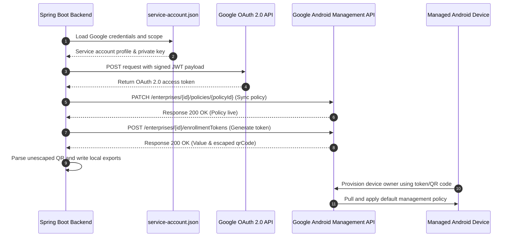

# Spring Boot backend powering Android Enterprise device enrollment and policy-based management using Google’s Android Management API.


A Spring Boot backend application providing enterprise integration with the Google Android Management API (AMAPI). The system handles programmatic enterprise linking, state-based policy synchronization, enrollment token generation, local provisioning file exports, and system-wide diagnostic health checks.

---

## 1. System Architecture

The following diagram illustrates the programmatic flow of token-based authentication and device management communications with the Google API endpoint:



---

## 2. Core Service Components

The application is structured into a clean, service-oriented architecture designed to handle service account authentication, REST API interactions, and startup health diagnostics.

### 2.1 Google Authentication Service (`GoogleAuthService`)
* **Role**: Manages credentials loading, JWT generation, and OAuth 2.0 handshake.
* **Responsibilities**:
  * Locates and loads `service-account.json` from the application root path.
  * Configures OAuth scope to `https://www.googleapis.com/auth/androidmanagement`.
  * Handles access token retrieval, including checking if the active token is expired and refreshing it dynamically (`credentials.refreshIfExpired()`).
  * Parses and extracts the target Google Cloud `project_id` programmatically from the service account key payload.

### 2.2 Android Management Service (`AndroidManagementService`)
* **Role**: Handles REST API requests to Google’s Android Management endpoints.
* **Responsibilities**:
  * **Enterprise Signup**: Requests programmatic signup URLs linked to the GCP project (`POST /v1/signupUrls`).
  * **Enterprise Listing**: Retrieves a list of active linked enterprises associated with the GCP project (`GET /v1/enterprises`).
  * **Policy Synchronization**: Patches state-based application policies (`PATCH /v1/enterprises/{enterpriseId}/policies/{policyId}`) to Google's servers.
  * **Enrollment Token Generation**: Programmatically requests new enrollment tokens (`POST /v1/enterprises/{enterpriseId}/enrollmentTokens`) bound to specific policies.
  * **Diagnostic Listing**: Performs diagnostic queries to list active enrolled devices (`GET /v1/enterprises/{enterpriseId}/devices`) and all existing policies (`GET /v1/enterprises/{enterpriseId}/policies`).
  * **Active Tokens Auditing**: Lists and parses all active, unexpired enrollment tokens (`GET /v1/enterprises/{enterpriseId}/enrollmentTokens`), extracting active counts, token names, policies, and expiration timestamps.
  * **Utility File Generation**: Extracts, unescapes, and writes enrollment data (`enrollment-token.txt` and `enrollment-qr.json`) to the local project root.

---

## 3. Implemented API Integrations

The system executes the following interactions with the Google Android Management API (v1):

| Interaction | HTTP Method | API Endpoint Path | Key Parameters / Payloads |
| :--- | :---: | :--- | :--- |
| **Enterprise Signup URL** | `POST` | `/v1/signupUrls?projectId={projectId}` | `{"callbackUrl": "https://localhost:8080"}` |
| **List Enterprises** | `GET` | `/v1/enterprises?projectId={projectId}` | Authenticated request header |
| **Synchronize Policy** | `PATCH` | `/v1/enterprises/{id}/policies/{policyId}` | Policy JSON defining apps and camera state |
| **Generate Enrollment Token** | `POST` | `/v1/enterprises/{id}/enrollmentTokens` | `{"policyName": "enterprises/{id}/policies/{policyId}"}` |
| **List Devices** | `GET` | `/v1/enterprises/{id}/devices` | Authenticated request header |
| **List Policies** | `GET` | `/v1/enterprises/{id}/policies` | Authenticated request header |
| **List Enrollment Tokens** | `GET` | `/v1/enterprises/{id}/enrollmentTokens` | Authenticated request header |

---

## 4. Execution Model (Diagnostic health check)

The application operates as a standalone console utility using a CommandLineRunner lifecycle. On startup, the `MainApplication` automatically redirects standard `System.out` console outputs to capture diagnostics, executing a comprehensive 9-stage health check:

```
==================================================
          ANDROID MANAGEMENT HEALTH CHECK
==================================================
1. Authentication: [PASS/FAIL] (Checks service-account.json structure and GCP Project ID)
2. Token retrieval: [PASS/FAIL] (Hands shake with Google OAuth to retrieve access token)
3. Enterprise lookup: [PASS/FAIL] (Queries linked enterprises list to verify active segments)
4. Policy validation: [PASS/FAIL] (Pushes default policy to Google to ensure policy endpoints are live)
5. Enrollment token generation: [PASS/FAIL] (Requests token bound to default policy and exports local files)
6. API connectivity: [PASS/FAIL] (Validates HTTP request-response flow to Google)
7. Device listing: [PASS/FAIL] (Retrieves and displays the active list of enrolled devices)
8. Policy listing: [PASS/FAIL] (Retrieves and displays all live policies on Google's servers)
9. Enrollment Tokens listing: [PASS/FAIL] (Retrieves and parses all active unexpired tokens)
==================================================
```

---

## 5. Local Generated Artifacts

Upon a successful health check execution, the application writes three diagnostic artifacts locally:

1. **`enrollment-token.txt`**: Contains the raw, 20-character enrollment token string (e.g. `XQOPCJHBZAAYASSDPKMQ`) used for manual text entry during device owner setup.
2. **`enrollment-qr.json`**: Contains the unescaped, clean JSON object payload mapping device owner provisioning parameters (component name, download location, checksum, and active token bundle) to be converted into a scannable QR graphic.
3. **`logs/health-check-<timestamp>.txt`**: Automatically intercepts the full stdout stream during execution and writes the full diagnostic health check results to a timestamped file for audit and demo purposes.

---

## 6. Setup & Running Instructions

### 6.1 Requirements
* **Java**: JDK 17
* **Build System**: Apache Maven (v3.8+)
* **Google Cloud Account**: Owner access to enable the Android Management API.

### 6.2 Setup Service Account Key
1. Go to your **Google Cloud Console**.
2. Select your target project and navigate to **IAM & Admin > Service Accounts**.
3. Create a Service Account and download its private key as a **JSON file**.
4. Save the key in the project root directory as **`service-account.json`** (ensure it matches the structure shown in `service-account.example.json`).

### 6.3 Execute Application
To run the full health check suite and generate local provisioning files, compile and run the application using Maven:
```bash
mvn spring-boot:run
```

---

## 7. Security and Repository Safety

> [!WARNING]
> Under no circumstances should private keys or generated enrollment files be committed to public repository branches. 

To maintain repository safety, a strict `.gitignore` is configured to exclude:
* `service-account.json` (Private key credential)
* `enrollment-token.txt` (Active token value)
* `enrollment-qr.json` (Active provisioning payload)
* `logs/` directory (Timestamped health check audit logs)
* `target/` directory (Compiled artifacts)

Always use the included `service-account.example.json` file as a placeholder reference when sharing config structures.

---

## 8. Troubleshooting & Common Failures

### 8.1 "Your organisation has reached usage limits"
* **Cause**: Newly created Google Cloud projects have a default safety quota of **0 devices** for the Android Management API. 
* **Resolution**: Go to **IAM & Admin > Quotas** in GCP, search for the **Android Management API**, select the **Devices** or **Enrollments** limit, and request an increase. Google reviews these requests manually.

### 8.2 "Something went wrong" (Provisioning Halt)
* **Cause**: The enrollment token generated is not bound to any policy, or the policy ID specified in the token does not exist on Google's servers.
* **Resolution**: The health check runner automatically synchronizes/creates the `default` policy on startup prior to requesting the token to ensure the device pulls a valid policy immediately upon setup.

### 8.3 "Invalid code" (Setup rejection)
* **Cause**: The scanned code contains an expired enrollment token.
* **Resolution**: Enrollment tokens default to a 1-hour expiration. Run the Spring Boot application again to generate a fresh token, then enter the new value from `enrollment-token.txt`.
